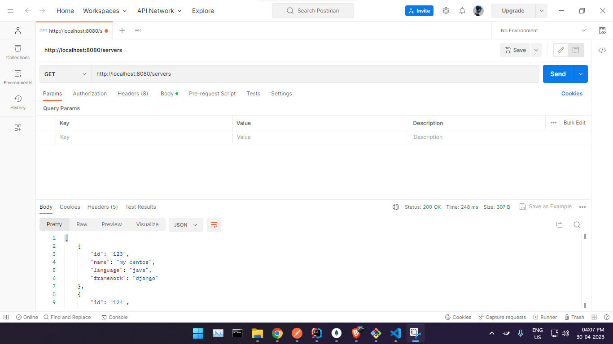
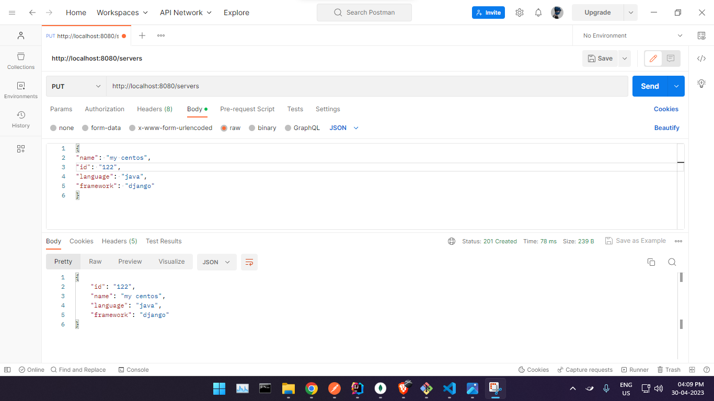
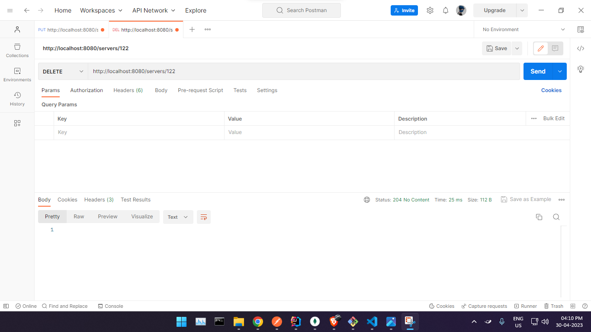
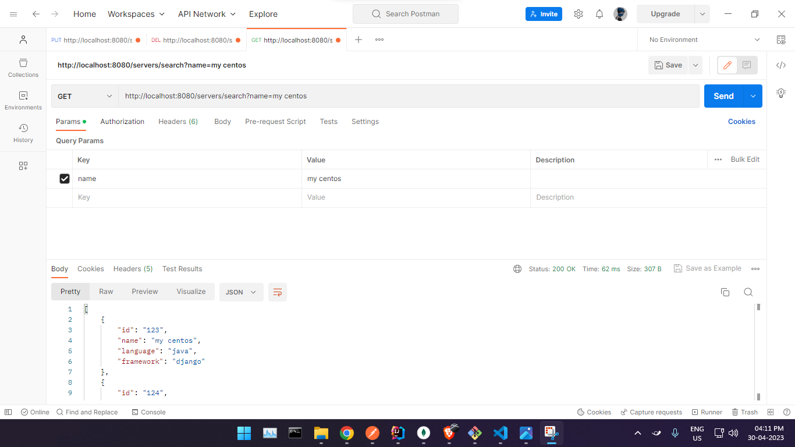

# Task-1

Java REST API example.

Project Name
A brief description of the project.

Table of Contents
Installation
Usage
Endpoints
Technologies Used
Contributing
License
Installation
Clone the repository: git clone https://github.com/<username>/<repository-name>.git
Navigate to the project directory: cd <repository-name>
Install the dependencies: npm install
Start the application: npm start
Usage
Provide instructions on how to use the application. For example, how to make requests to the REST API using Postman or cURL.

Endpoints
The following endpoints are available:

GET /servers
Returns all servers if no parameters are passed. When server ID is passed as a parameter - return a single server or 404 if there’s no such a server.

PUT /servers
Adds a server object to the database. The server object is passed as a json-encoded message body. Here’s an example:
{
“name”: ”my centos”,
“id”: “123”,
“language”:”java”,
“framework”:”django”
}

DELETE /servers/:id
Deletes a server by ID.

GET /servers/find/:name
Finds servers by name. The parameter is a string. Must check if a server name contains this string and return one or more servers found. Return 404 if nothing is found.

Technologies Used
Java
MongoDB
springboot
Contributing
Contributions are welcome. Please create a pull request explaining your changes.

License
This project is licensed under the MIT License.
